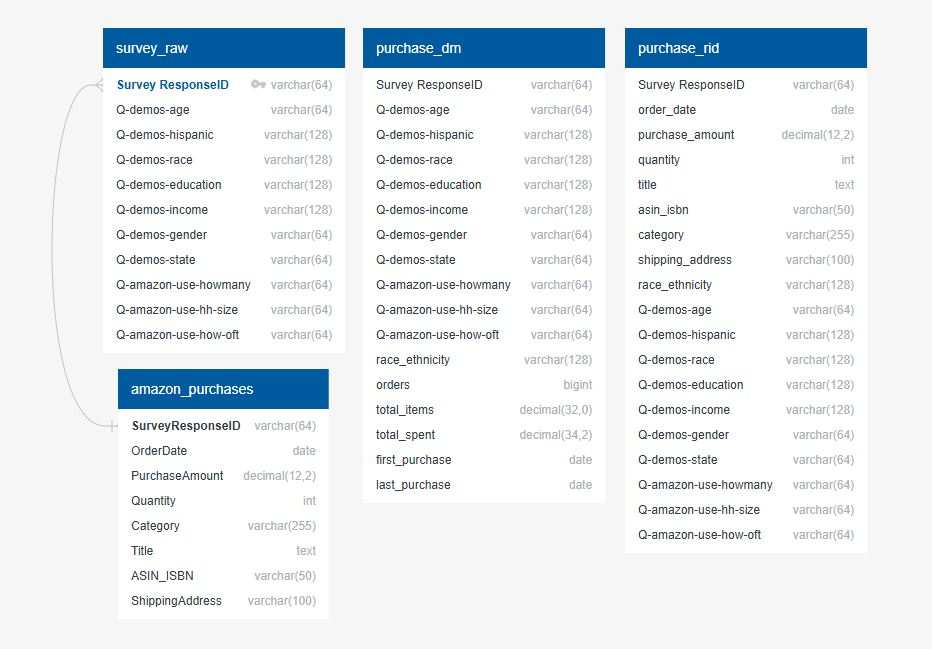

# Background and Overview: 
The goal of the project is to investigate the performance of various demographics in a sample of Amazon users in order to develop actionable recommendations for future marketing strategies. This analysis aims to provide insights that can guide targeted campaigns, improve customer engagement, and support long-term growth initiatives. 

The Amazon purchase dataset was collected through an online survey administered via Prolific and CloudResearch. Eligible participants were U.S. residents aged 18 or older with active Amazon accounts in use since 2018. Each participant received $0.35 for a brief prescreen and $1.50 for completing the main survey. With informed consent, they shared their purchase history, forming the dataset for this analysis. The data spans 2018–2022, but for relevancy the analysis focuses on more recent purchasing behavior, excluding years with limited participation. 

## Data Structure Overview

## Insights summary:  
In order to evaluate customer behavior and marketing oppertunities, we focoused on the following key metrics 

* **Customer Segmentations:** Identifying purchasing behaviors of across demographics such as age, gender, income, and household size.  
* **Seasonal Trends:** Analyzing spending patterns across months and quarters per year. 
* **Regional:** Highlighting which regions perform above and below the national average in spending.

## Executive Summary 
* The top 10% of customers by overall spending were primarily concentrated in the 25-44 age, with 62% reporting an annual income of more than $75,000. 
* Household Size and age were strong indicators of level of spending 
* Spending consistently peaked in Q4 and in the early summer months. Indicating clear opportunities for campaigns.  
* A majority of high performing states were found in the Northeast and West, while many underperforming states appeared in the northern region.

## Insights/Deep Dive 

### Customer Segmentations 
* **Age Groups:** From 2021 and 2022, age groups 35-44 and 45-54 showcased the highest average spending per year. 
* **Age Groups:** The 35-44 age group spent 76% more than the 18-24 age group and 28% more than customers 65+, making this a target demographic. 
* **Household Size:** Larger households (4+) outperformed the average spent while single households underperformed by (19%). Marketing to families presents a stronger ROI.  
* **Income Levels:** Higher income customers spent more overall, but mid-income groups also showed strong engagement.

### Seasonal Trends 
* **Quarterly Spending 2021:** Q4 2021 experienced the highest spike in the dataset, coming from the lowest point observed in Q3.  
* **Quarterly Spending 2022:** The 2022 quartile stats are noticeably lower than 2021 with the exception of a strong Q3. 
* **Gender Comparison:** Male and Female customers showed similar monthly spending throughout the year, with only a slight difference between the groups. 
* **Monthly Patterns:** Spending spikes were observed in March, June, November, and December.

### Regional Analysis 
* State-level spending against the national average showed a wide distribution across the U.S. 
* **High-Performing Regions:** Strongest states were in the Northeast and West, outperforming the national average. 
* **Low-Performing Regions:** Many Northern states underperformed relative to the national benchmark 
* **Regional Variance (2022):** The spread between the top and bottom performing states in 2022 was approximately 76% relative to the national average, highlighting significant geographic disparities in Amazon shopping behavior.c 

## Recommendations
Our recommendations our catered to the marketing department regarding what customer demographic should be advertised to. 

### Maintaining high Q4 sales 
* **Holiday campaign:** Emphasizing convenience of gifting for the holiday season in Q4 when spending is at its highest.  
* **Summer promotions:** Launch targeted summer and end of season campaigns to capitalize on the spikes in June/July. 
### Customer Growth and Retention 
* **Leverage Core** Customer Insights: Focus campaigns on the age group 25-44 and larger households, which had the highest spending levels. 
* **Targeted Ads:** Create family-oriented promotions for larger households (4+). Highlighting products for children and household activities.  
* **Loyalty Programs:** Develop incentives by introducing repeat purchase discounts and product subscriptions.
* ### Regional Growth Strategies 
* **Focus On High-Performing Regions:** Allocate a larger portion of the budget to Northeast and West coast states where spending exceeds the national average. 
* **Localized Messaging:** Tailor campaigns by region (urban vs. rural) emphasizing convenience and relevance to customer needs. 
### Demographic Expansion 
* **Middle Income:** Middle income customers showed strong engagement that offer potential for everyday affordability campaigns. Emphasizing deals on daily essentials. 
* **Age Group:** The 18-24 age group are currently low spenders but represent long-term customer potential. Campaigns should focus on building brand loyalty.

## Clarifying Questions
* **Data Gaps:** Thousands of rows in amazon_purchases contained missing values for title and category. These fields were normalized to "Unknown" to since every record had an asin_isbn. 
* **Date Range:** Although the dataset documentation indicates coverage through 2022, the raw data included 3,506 purchases from 2023 and one record from 2024. Clarification is needed on whether these transactions should be retained or excluded for accuracy. 
* **Geographic Labels:** District of Columbia appeared in the data but is not a U.S. state. Guidance is required on whether to treat it as a separate region, merge it with surrounding states, or exclude it from state-level comparisons.

## Dashboard 
Explore the full interactive Tableau dashboard by clicking the image below.

### Original Dataset  
[Click here for link to original data](https://dataverse.harvard.edu/dataset.xhtml?persistentId=doi%3A10.7910%2FDVN%2FYGLYDY)

